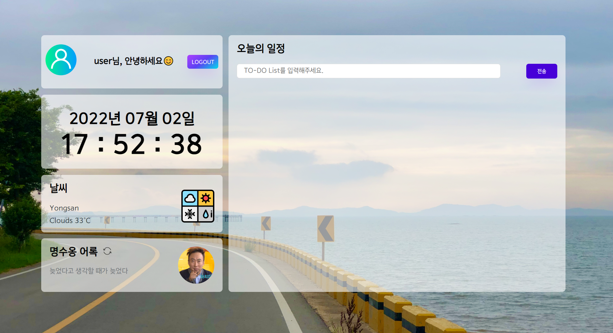
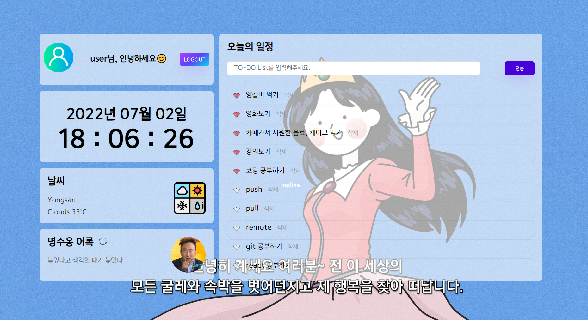

# momentum ⌚

## url 바로가기
https://landhyun.github.io/momentum/main.html

## 미리보기
1. 로그인 페이지

2. 메인 페이지

## 설명
명수옹 어록, 배경 이미지가 랜덤으로 변경됩니다.
API 활용으로 해당 지역의 날씨를 확인하며, TO-DO List는 중요한 일정을 ❤️로 구분할 수 있습니다. 
이름, 일정의 모든 데이터는 브라우저 로컬스토리지에 저장되며 로그아웃 시 초기화됩니다.

 
<blockquote>
노마드코더 강의 클론코딩 (바닐라 JS로 크롬앱 만들기) 
Chrome Apps made with vanilaJS from nomadcoders
